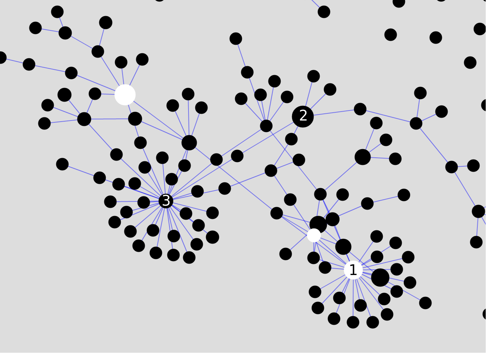
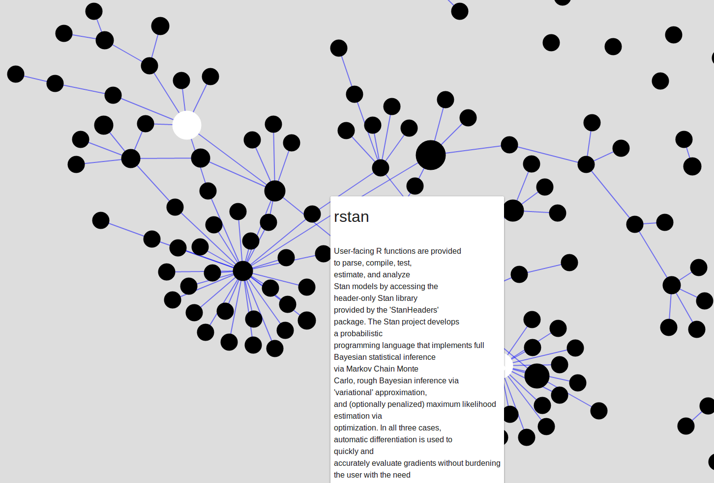

# Summary

``packexplorer`` is an R [@rcoreteam:2019]  package with user friendly exploratory functions, mainly based on ``igraph``[@csardi:2006] and ``leaflet`` [@cheng:2018] packages. ``packexplorer`` allows the user to interactively navigate the CRAN package network departing from her/his own packages. It provides functions for exploring a package closeness, visiting packages mostly related to the user's, and building topic related networks. It also provides a scoring system for suggesting new packages to install. The aim is to assist researchers in their daily search of new work tools. At the moment ``packexplorer`` includes essentially four functions:

- ``recommend_me``: which generates a ranking among the not-yet installed packages, based on their dependency relations with those already installed, from which the user can choose to further investigate.
- ``plot_neighbors``: which allows the user to navigate a specific dependency network (based on Imports, Depends or Suggests relationships) starting from a set of packages (which can be the user's installed packages), and leading to the set of packages up to a specified maximum number of steps in the chosen network.
- ``who_are_you``: which generates the EGO network of a package, focusing on a central package and all their first connections.
- ``expre2graph``: which generates the network including all the packages containing certain regular expression on their description.

# General setup
Except for ``recommend_me``, which returns a vector of score values (each recommended package's score of relatedness to those already installed), function's outputs consist of ``igraph`` objects containing a built network, and ``leaflet`` objects including the plot of that network. Network node size can be related to the number of package's downloads and defined scores, making the detection of relevant packages easier. ``leaflet`` based networks provide an interactive view of how packages relate to one another, alongside with the available package's description, making the selection of packages to install or further investigate easier.

# Need and application
Nowadays scientific research strongly depends on open source software. From a researcher point of view, it is difficult to find both, freshly developed and topic related software in R, as the quantity of available resources grows quickly [@hornik:2012]. Typical search tools include the use of google browser (where the user already knows what to look for), METACRAN (including additional information like package downloads or general recommendations) or blog based research. None of these options allow the user to improve the search based on her/his own previously installed packages, added topic information and relevance of packages based on downloads by the community. We aim to solve that gap between the researcher and the whole available R library by providing some user friendly tools.

# Active improvement
The package also includes an optional function based on ``mailR`` [@premraj:2015] that allows the user to directly send her/his own list of packages, alongside with some information about the area of work. We aim to use this information for further development, such as work area oriented recommendation. The user can call ``send_your_packages`` directly from the console to send an email within the R session, indicating it's own packages and areas of interest.

# An example of topic related search with ``packexplorer``
Consider that you're interested in new Bayesian methods within the R enviroment, so you make a ``expre2graph('bayesian')``. This generates a network, partially shown in fig. 1. This network has packages as nodes, with black nodes corresponding to not yet installed packages and white nodes for already installed packages, and edges dependency relationships. This network shows some central nodes (those with more connections). In particular, ``rstan`` (node 1), ``mclust`` (node 2) and ``MCMCpack`` (node 3). ``rstan`` is important both, in monthly downloads (related to the diameter of the circle) and network centrality (as it relates multiple packages). On the other hand, ``mclust`` has many downloads, but it is not very central, and ``MCMCpack`` has many dependants, but not many downloads. This whole picture, with the addition of easy and accessible descriptions of the involved packages, helps the user to quickly find the most basic packages to explore, and the bunch of resources each package provides. As  each root package usually comes with its own logic, the knowledge of the whole set of available resources may help to choose among multiple branches of similar packages. In the right hand side of fig.1 we see the same network, but with node description displayed. It can be seen that this ``leaflet`` based network display allow to interactively show package description, number of downloads, relatedness to already installed packages, tematic area. Finally, this ``leaflet`` based interface, also include drag panning, as well as zoom in and zoom out, capabilities, helping the user to travel around the network inspecting its resources and connections.

 

Figure 1: (Left) Topic network generated with ``expre2graph('bayesian')``. White circles represent already installed packages, and black circles, new packages. Links indicate a dependency relation between nodes. Node 1 is ``rstan``, node 2 is ``mclust`` and node 3 is ``MCMCpack``. (Right) Same network, now with the description of the ``rstan`` package displayed as the user's pointer passes over the node.

# References
